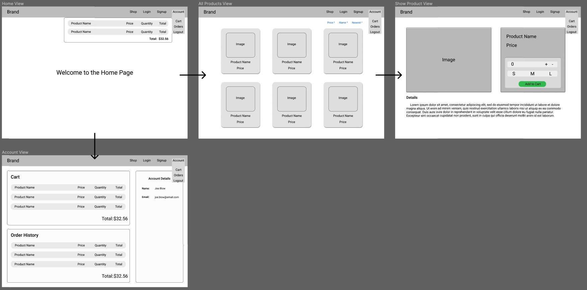

# ECommerce

## Overview
Out group is building an e-commerce site. We will be using an express/postgres backend and a react frontend, which will live in separate repos on github and separate deployments on heroku.

## Planning
1. Database schema diagram
1. Wireframes
    
1. Backend http routes inventory
1. Frontend component tree, including state and frontend routes

## Core Goals
- [] When I first visit the site, I'm on a home page that just has a simple welcome message.
- [] When not logged in, I see links to home, signup & login only. 
    -[] If I were to visit any of these routes manually while logged in, I would get redirected to the home page.
- [] I can create an account, log in, and log out. The stretch goals from https://github.com/SEI-ATL-3-8/auth-replay are all implemented.
- [] When logged in, I see links to home, logout, All Products, My Cart, and My Orders.
    - [] If I were to visit any of these routes manually while logged out, I would get redirected to the home page.
- [] The All Products page lists the names of all available products. 
    - [] Clicking on any product name takes me to its details page, which include a name, description, image, and price. The products are pre-seeded in the db. 
    - [] In the Product Details page is an Add To Cart button, which saves the product in my cart. 
    - [] If I want to buy more than 1 of a product in an order, I can add it to my cart multiple times, and each one is displayed as a distinct product. (There's no way to buy in bulk.)
- [] The My Cart page lists products that I have put into my cart. 
    - [] Next to each product is a Remove From Cart button, which removes the item from my cart (the item should disappear from the page without requiring a page refresh). 
    - [] The total of my order is displayed on the page (we're ignoring tax and shipping). 
    - [] There is a Checkout button which creates an order containing all the items from my cart, then empties the cart. 
        - [] In order to checkout, the shopper must input an address and a credit card number. 
        - [] These values will get saved to the order, but we won't do anything with them in this project. 
    - [] After checking out, the user is redirected to the My Orders page.
- [] The My Orders page displays a list of my completed orders, using the date of the order as a clickable link. 
    - [] When I click on a single order, I see the Single Order page, which shows its products (name and price), the total price of the order, and the credit card & address.

## Stretch Goals
*HOT TIP*: While it's a good idea to read these before beginning, don't contort your db schema, routes, wireframes, or component trees to accommodate these stretch goals. Cross that bridge when you get there!
- [] Each Product has a quantity in the database. When a user buys a product, its quantity is reduced. Products with a quantity of 0 are not displayed in the All Products page. (A user can still only buy 1 of a product at a time.)
- [] The app has one (or more) designated admin users. When an admin user logs in, they do not see the All Products, My Cart, and My Orders links. Instead, they see Manage Products and Orders To Fill.
- [] Manage Products MVP: The admin user sees a list of all products, and next to each one is an input to adjust the quantity of that product.
- [] Orders To Fill MVP: The admin user sees a list of all orders (from all users), which initially are in a Pending state. For each order, the admin user can click a button to convert it from Pending to Shipped. Shipped orders don't have a button, just a text or icon indicator that they've been shipped.
- [] Manage Products stretch: The admin user can add new products, and edit or delete existing ones.